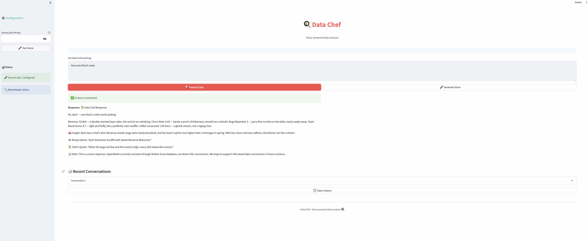

# 🍳 Data Chef

A Streamlit application that demonstrates voice-powered data analysis with ElevenLabs voice generation and HyperMode integration through Mother Duck database. This is a voice generation demo that shows how to integrate ElevenLabs text-to-speech capabilities with data analysis workflows.

## Features

- **Voice Generation**: Use ElevenLabs to convert text to natural speech
- **Mock Data Responses**: Demonstrates voice generation with sample responses
- **Real-time Chat**: Interactive interface for testing voice generation
- **Conversation History**: Track and review previous voice generations
- **Modern UI**: Clean, minimalist interface with professional styling
- **Security**: Git hooks and secrets scanning for safe development

## 📸 Application Screenshot

Here's a glimpse of the Data Chef application in action:



*The interface shows a clean, minimalist design with a sidebar for configuration and a main chat area. Users can ask questions like "How was March sales" and receive detailed, chef-themed responses with voice generation capabilities.*

## Prerequisites

- Python 3.8 or higher (Python 3.13 recommended)
- ElevenLabs API key (optional for voice features)

## Quick Start

### 1. Clone or navigate to the project directory:
```bash
cd data_chef_app
```

### 2. Create and activate virtual environment:
```bash
# Create virtual environment
python3 -m venv venv

# Activate virtual environment
# On macOS/Linux:
source venv/bin/activate
# On Windows:
# venv\Scripts\activate
```

### 3. Install dependencies:
```bash
pip install -r requirements.txt
```

### 4. Set up environment variables (optional):
Create a `.env` file in the project root:
```env
# ElevenLabs Configuration (Optional - for voice features)
ELEVENLABS_API_KEY=your_elevenlabs_api_key_here

# Mother Duck Database Configuration (for real HyperMode integration)
MOTHER_DUCK_DATABASE_URL=your_mother_duck_connection_string
MOTHER_DUCK_API_KEY=your_mother_duck_api_key

# Application Configuration
STREAMLIT_SERVER_PORT=8501
STREAMLIT_SERVER_ADDRESS=localhost
STREAMLIT_BROWSER_GATHER_USAGE_STATS=false
```

### 5. Run the application:
```bash
# Option 1: Run main entry point
python main.py

# Option 2: Run directly with streamlit
streamlit run src/core/app.py
```

### 6. Access the app:
Open your web browser and go to: **http://localhost:8501**

## Installation Commands Summary

```bash
# Complete setup in one go:
cd data_chef_app
python3 -m venv venv
source venv/bin/activate  # On Windows: venv\Scripts\activate
pip install -r requirements.txt
python main.py
```

## Project Structure

```
data_chef_app/
├── main.py                    # Main entry point
├── src/                       # Source code directory
│   ├── __init__.py           # Package initialization
│   ├── core/                 # Core application logic
│   │   ├── __init__.py      # Core package
│   │   └── app.py           # Main Streamlit application
│   ├── config/               # Configuration management
│   │   ├── __init__.py      # Config package
│   │   └── settings.py      # Application settings
│   └── utils/                # Utility functions
│       ├── __init__.py      # Utils package
│       ├── voice_utils.py    # Voice generation utilities
│       ├── data_utils.py     # Data processing utilities
│       └── validation.py     # Input validation utilities
├── requirements.txt           # Python dependencies
├── README.md                 # This file
├── .env.example              # Environment variables template
├── .gitignore                # Git ignore rules
└── venv/                     # Virtual environment (created)
```

## Streamlit App Details

### App Structure
- **Main Interface**: Clean chat-based data analysis with voice generation
- **Sidebar**: Streamlined configuration panel for API keys and status
- **Status Panel**: Real-time connection status and system info
- **Conversation History**: Track recent interactions (last 3)

### Key Components
- **DataChef Class**: Main application logic with conversation management
- **ElevenLabsClient**: Voice generation integration
- **HyperModeMCP**: Data analysis through Mother Duck database (mock mode)
- **Streamlit UI**: Modern, minimalist interface with professional styling

### Features Available
- ✅ **Mock Mode**: Working with sample data responses
- ✅ **Voice Generation**: ElevenLabs integration (with API key)
- ✅ **Interactive Chat**: Ask questions and get responses
- ✅ **Voice Testing**: Test voice generation with sample text
- ✅ **Conversation History**: Track recent interactions
- ✅ **Status Monitoring**: Real-time system status
- ✅ **Mother Duck Integration**: HyperMode database architecture (mock)
- ✅ **Security**: Git hooks and secrets scanning
- ✅ **Professional Structure**: Modular code organization

## Usage

### Basic Usage (No API Key Required)
1. **Start the app**: `python main.py` or `streamlit run src/core/app.py`
2. **Open browser**: Go to `http://localhost:8501`
3. **Test features**: Use the chat interface and voice buttons
4. **View mock responses**: See how the voice generation works

### Advanced Usage (With ElevenLabs API Key)
1. **Get ElevenLabs API key**: Sign up at [elevenlabs.io](https://elevenlabs.io)
2. **Enter API key**: Use the sidebar configuration
3. **Test voice generation**: Click voice buttons to generate speech
4. **Custom voice**: Change voice settings in the configuration

### Voice Generation Features
- **Text-to-Speech**: Convert any text to natural speech
- **Multiple Voices**: Choose from ElevenLabs voice library
- **Real-time Playback**: Listen to generated audio immediately
- **Conversation History**: Generate voice from previous responses

## Configuration

### ElevenLabs Setup
1. **Get API Key**: Sign up at [elevenlabs.io](https://elevenlabs.io)
2. **Add to App**: Enter in sidebar configuration
3. **Test Connection**: Use "Test Voice" button
4. **Generate Speech**: Use voice buttons throughout the app

### HyperMode & Mother Duck Setup
1. **Mother Duck Database**: Set up database connection for real data analysis
2. **HyperMode Integration**: Configure HyperMode to use Mother Duck
3. **Database Credentials**: Add Mother Duck connection string to .env
4. **Real Data Analysis**: Replace mock responses with actual database queries

### App Settings
- **Server Port**: Default 8501 (configurable in .env)
- **Server Address**: Default localhost
- **Voice Model**: Default "eleven_monolingual_v1"
- **Default Voice**: "EXAVITQu4vr4xnSDxMaL"
- **Database**: Mother Duck (mock mode)

## Security & Git Setup

### Git Security Features
- **Pre-commit hooks**: Scan for secrets before commits
- **git-secrets integration**: Prevent API key leaks
- **Environment variable protection**: .env files excluded from Git
- **Comprehensive .gitignore**: Excludes sensitive files

### Development Best Practices
- **Modular structure**: Organized code in logical packages
- **Type hints**: Improved code readability
- **Documentation**: Comprehensive docstrings and comments
- **Error handling**: Robust error management
- **Security scanning**: Automated secrets detection

## Troubleshooting

### Common Issues

**1. "streamlit: command not found"**
```bash
# Solution: Activate virtual environment
source venv/bin/activate
python main.py
```

**2. Import errors with ElevenLabs**
```bash
# Solution: Reinstall dependencies
pip install --upgrade -r requirements.txt
```

**3. Port already in use**
```bash
# Solution: Use different port
streamlit run src/core/app.py --server.port 8502
```

**4. Virtual environment issues**
```bash
# Solution: Recreate virtual environment
rm -rf venv
python3 -m venv venv
source venv/bin/activate
pip install -r requirements.txt
```

### Python Version Compatibility
- **Python 3.8+**: Fully supported
- **Python 3.13**: Recommended (latest features)
- **Dependencies**: All packages tested with Python 3.13

## Development

### Key Dependencies
- **streamlit==1.28.1**: Web application framework
- **elevenlabs==0.2.26**: Voice generation API
- **python-dotenv==1.0.0**: Environment variable management
- **websockets==12.0**: WebSocket communication
- **requests==2.31.0**: HTTP requests
- **pydantic>=2.6.0**: Data validation

### Adding Features
1. **Extend DataChef class**: Add new functionality in `src/core/app.py`
2. **Update UI**: Modify Streamlit components
3. **Add utilities**: Create new modules in `src/utils/`
4. **Update configuration**: Modify `src/config/settings.py`
5. **Test thoroughly**: Ensure compatibility

### Code Organization
- **src/core/**: Main application logic
- **src/config/**: Configuration and settings
- **src/utils/**: Utility functions and helpers
- **Documentation**: README, PROJECT_STRUCTURE.md, GIT_READY_CHECKLIST.md

## Support

### Getting Help
- **Check troubleshooting section** above
- **Review Streamlit documentation**: [streamlit.io](https://streamlit.io)
- **ElevenLabs API docs**: [elevenlabs.io/docs](https://elevenlabs.io/docs)
- **Python virtual environments**: [docs.python.org](https://docs.python.org/3/tutorial/venv.html)


---

**Data Chef** - Voice-powered data analysis assistant 🍳

*Powered by Streamlit & ElevenLabs* 